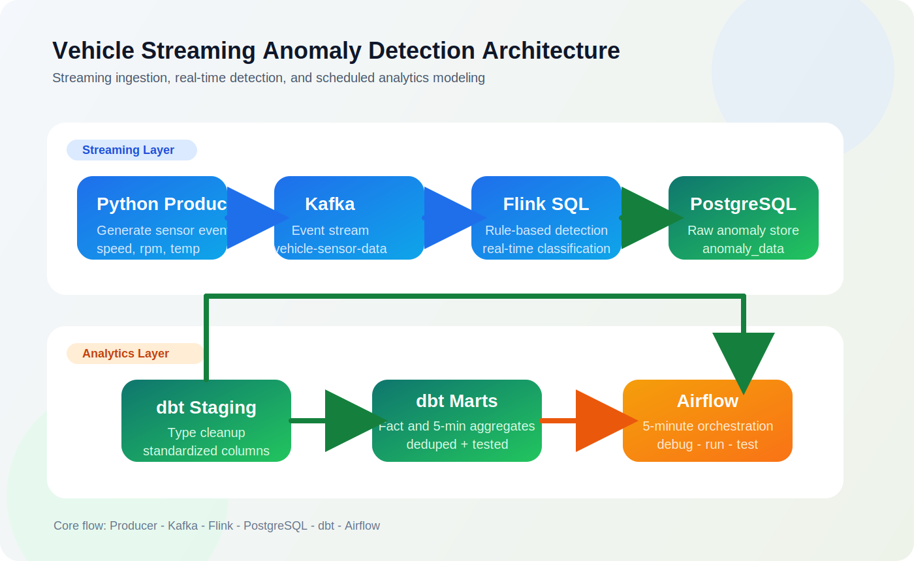
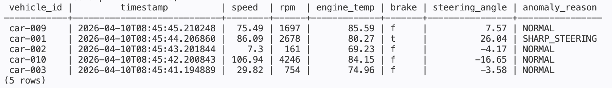
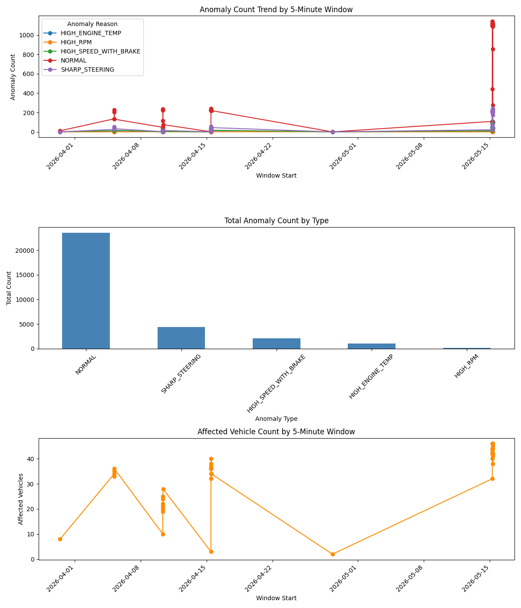

# Real-Time Vehicle Anomaly Detection Pipeline



---

## English

### Overview

This repository is a data engineering project that combines a streaming layer and an analytics layer for vehicle anomaly detection.

End-to-end flow:

`Producer -> Kafka -> Flink -> PostgreSQL -> dbt -> Airflow`

- `Producer`: generates random vehicle sensor events
- `Kafka`: stores and streams events
- `Flink`: detects anomalies in real time
- `PostgreSQL`: stores raw anomaly results
- `dbt`: transforms raw data into staging, fact, and aggregate models
- `Airflow`: orchestrates dbt runs and tests
- `Terraform + GCP`: provisions cloud infrastructure for future deployment

### Why This Project

- To practice real-time streaming with Kafka and Flink
- To model analytics data with `raw -> staging -> marts`
- To connect streaming, analytics, orchestration, and infrastructure in one project

### Detection Rules

Current Flink SQL rules:

- `engine_temp > 90` -> `HIGH_ENGINE_TEMP`
- `rpm > 4500` -> `HIGH_RPM`
- `speed > 100 AND brake = TRUE` -> `HIGH_SPEED_WITH_BRAKE`
- `ABS(steering_angle) > 25` -> `SHARP_STEERING`
- otherwise -> `NORMAL`

### Data Model Flow

`public.anomaly_data -> stg_anomaly_data -> fct_vehicle_anomalies -> agg_anomaly_counts_5m`

- `public.anomaly_data`: raw anomaly output from Flink
- `stg_anomaly_data`: type cleanup and standardization
- `fct_vehicle_anomalies`: event-level fact table with dedupe and severity
- `agg_anomaly_counts_5m`: 5-minute aggregate for dashboarding

### Data Quality Checks

Current dbt quality checks include:

- `not_null` on key source, staging, and aggregate columns
- `unique` on `fct_vehicle_anomalies.anomaly_event_key`
- `accepted_values` on `anomaly_reason` and `severity_level`
- custom freshness-style test in `dbt/tests/test_recent_events.sql`

These checks are used to catch:

- null values
- duplicate anomaly events
- unexpected anomaly labels
- invalid severity values
- recent data ingestion stoppage

### How to Run

Start the streaming pipeline:

```bash
python3 flink/job.py
```

Run the producer:

```bash
.venv/bin/python producer/producer.py
```

Check Flink job status:

```bash
docker exec jobmanager /opt/flink/bin/flink list
```

Check PostgreSQL results:

```bash
docker exec postgres psql -U flinkuser -d vehicle_db -c "SELECT * FROM anomaly_data ORDER BY timestamp DESC LIMIT 5;"
```

Start Airflow + dbt:

```bash
docker compose up -d airflow-postgres airflow-init airflow-webserver airflow-scheduler
```

Run dbt tests:

```bash
docker exec airflow-scheduler bash -lc "cd /opt/airflow/dbt && dbt test --profiles-dir /opt/airflow/dbt"
```

### What Was Verified

Verified items:

- `python3 flink/job.py` runs successfully
- Kafka topic auto-creation works
- Flink job reaches `RUNNING`
- Kafka -> Flink -> PostgreSQL data flow works
- Airflow DAG `dbt_vehicle_analytics` runs successfully
- `dbt debug`, `dbt run`, and `dbt test` succeed
- additional dbt data quality checks were added
- GCP Terraform `plan` and `apply` succeed
- Compute Engine VM provisioning succeeds



### Dashboard

Current example dashboard:



The next goal is to visualize mart-based analytics such as `agg_anomaly_counts_5m` instead of relying only on raw data.

### Cloud Provisioning with GCP + Terraform

This repository includes a small Terraform-based GCP provisioning layer.

Completed:

- created GCP project `vehicle-anomaly-pipeline`
- connected billing
- configured `gcloud` authentication and ADC
- enabled Compute Engine API
- provisioned a Compute Engine VM with Terraform
- verified VM outputs

Not completed yet:

- deploying the full Kafka/Flink/PostgreSQL/dbt/Airflow stack on the VM
- running the full pipeline end-to-end inside GCP

Current cloud scope:

- infrastructure provisioning: completed
- application deployment: not completed yet

Basic Terraform flow:

```bash
cd infra/terraform
/opt/homebrew/bin/terraform init
/opt/homebrew/bin/terraform plan
/opt/homebrew/bin/terraform apply
```

Cleanup:

```bash
/opt/homebrew/bin/terraform destroy
```

### Key Files

- `producer/producer.py`
- `flink/anomaly.sql`
- `flink/job.py`
- `postgres/init.sql`
- `dbt/models/staging/stg_anomaly_data.sql`
- `dbt/models/marts/fct_vehicle_anomalies.sql`
- `dbt/models/marts/agg_anomaly_counts_5m.sql`
- `dbt/models/sources.yml`
- `dbt/tests/test_recent_events.sql`
- `airflow/dags/dbt_vehicle_pipeline.py`
- `infra/terraform/main.tf`

### Troubleshooting Notes

- Kafka topic creation used to depend on prior local state, so topic auto-creation was added to `flink/job.py`
- dbt uniqueness tests initially failed because raw events could be duplicated, so dedupe logic was added to `fct_vehicle_anomalies.sql`
- Airflow dbt debug failed before `git` was installed in the Airflow image
- Terraform apply initially failed until Compute Engine API was enabled

### Future Improvements

- deploy the full Docker-based pipeline on the GCP VM
- expand the dashboard with mart-based metrics
- add more operational tests such as row-count anomaly checks
- document failure handling and rerun strategy
- build one more batch-oriented data engineering project

---

## 한국어

### 개요

이 레포는 차량 이상 탐지를 위한 스트리밍 계층과 분석 계층을 함께 담은 데이터 엔지니어링 프로젝트입니다.

전체 흐름:

`Producer -> Kafka -> Flink -> PostgreSQL -> dbt -> Airflow`

- `Producer`: 랜덤 차량 센서 이벤트 생성
- `Kafka`: 이벤트 저장 및 스트리밍
- `Flink`: 실시간 이상 탐지
- `PostgreSQL`: raw anomaly 결과 저장
- `dbt`: raw 데이터를 staging, fact, aggregate 모델로 변환
- `Airflow`: dbt 실행과 테스트를 스케줄링
- `Terraform + GCP`: 이후 배포를 위한 클라우드 인프라 프로비저닝

### 왜 이 프로젝트를 했는가

- Kafka와 Flink를 사용한 실시간 스트리밍 처리를 연습하기 위해
- `raw -> staging -> marts` 구조를 직접 모델링해보기 위해
- 스트리밍, 분석, 오케스트레이션, 인프라를 한 프로젝트 안에서 연결해보기 위해

### 이상 탐지 규칙

현재 Flink SQL 규칙:

- `engine_temp > 90` -> `HIGH_ENGINE_TEMP`
- `rpm > 4500` -> `HIGH_RPM`
- `speed > 100 AND brake = TRUE` -> `HIGH_SPEED_WITH_BRAKE`
- `ABS(steering_angle) > 25` -> `SHARP_STEERING`
- 그 외 -> `NORMAL`

### 데이터 모델 흐름

`public.anomaly_data -> stg_anomaly_data -> fct_vehicle_anomalies -> agg_anomaly_counts_5m`

- `public.anomaly_data`: Flink가 적재한 raw anomaly 결과
- `stg_anomaly_data`: 타입 정리와 컬럼 표준화
- `fct_vehicle_anomalies`: dedupe와 severity를 포함한 이벤트 단위 fact 테이블
- `agg_anomaly_counts_5m`: 대시보드용 5분 집계 테이블

### 데이터 품질 체크

현재 dbt 품질 테스트:

- 핵심 source, staging, aggregate 컬럼에 대한 `not_null`
- `fct_vehicle_anomalies.anomaly_event_key`에 대한 `unique`
- `anomaly_reason`, `severity_level`에 대한 `accepted_values`
- `dbt/tests/test_recent_events.sql` 기반 최근 데이터 유입 확인 테스트

이 테스트들은 아래 문제를 잡기 위한 목적입니다.

- null 값 유입
- anomaly 이벤트 중복
- 예상하지 않은 anomaly 라벨
- 잘못된 severity 값
- 최근 데이터 유입 중단

### 실행 방법

스트리밍 파이프라인 시작:

```bash
python3 flink/job.py
```

프로듀서 실행:

```bash
.venv/bin/python producer/producer.py
```

Flink job 상태 확인:

```bash
docker exec jobmanager /opt/flink/bin/flink list
```

PostgreSQL 적재 결과 확인:

```bash
docker exec postgres psql -U flinkuser -d vehicle_db -c "SELECT * FROM anomaly_data ORDER BY timestamp DESC LIMIT 5;"
```

Airflow + dbt 시작:

```bash
docker compose up -d airflow-postgres airflow-init airflow-webserver airflow-scheduler
```

dbt 테스트 실행:

```bash
docker exec airflow-scheduler bash -lc "cd /opt/airflow/dbt && dbt test --profiles-dir /opt/airflow/dbt"
```

### 실제로 검증한 것

검증 완료 항목:

- `python3 flink/job.py` 실행 성공
- Kafka 토픽 자동 생성 동작 확인
- Flink job `RUNNING` 상태 확인
- Kafka -> Flink -> PostgreSQL 적재 확인
- Airflow DAG `dbt_vehicle_analytics` 실행 성공
- `dbt debug`, `dbt run`, `dbt test` 성공
- dbt 데이터 품질 테스트 추가
- GCP Terraform `plan`, `apply` 성공
- Compute Engine VM 프로비저닝 성공


### 대시보드

현재 예시 대시보드:


다음 단계에서는 raw 데이터 위주가 아니라 `agg_anomaly_counts_5m` 같은 mart 기반 지표를 시각화하는 것이 목표입니다.

### GCP + Terraform 클라우드 프로비저닝

이 레포에는 Terraform 기반 GCP 프로비저닝 레이어도 포함돼 있습니다.

완료한 것:

- GCP 프로젝트 `vehicle-anomaly-pipeline` 생성
- Billing 연결
- `gcloud` 인증과 ADC 설정
- Compute Engine API 활성화
- Terraform으로 Compute Engine VM 프로비저닝
- VM output 확인

아직 하지 않은 것:

- 해당 VM에 Kafka/Flink/PostgreSQL/dbt/Airflow 전체 스택 배포
- GCP 내부에서 전체 파이프라인 end-to-end 실행

현재 클라우드 범위:

- 인프라 프로비저닝: 완료
- 애플리케이션 배포: 아직 안 함

기본 Terraform 흐름:

```bash
cd infra/terraform
/opt/homebrew/bin/terraform init
/opt/homebrew/bin/terraform plan
/opt/homebrew/bin/terraform apply
```

정리 명령:

```bash
/opt/homebrew/bin/terraform destroy
```

### 핵심 파일

- `producer/producer.py`
- `flink/anomaly.sql`
- `flink/job.py`
- `postgres/init.sql`
- `dbt/models/staging/stg_anomaly_data.sql`
- `dbt/models/marts/fct_vehicle_anomalies.sql`
- `dbt/models/marts/agg_anomaly_counts_5m.sql`
- `dbt/models/sources.yml`
- `dbt/tests/test_recent_events.sql`
- `airflow/dags/dbt_vehicle_pipeline.py`
- `infra/terraform/main.tf`

### 트러블슈팅 메모

- 예전에는 Kafka 토픽 생성이 로컬 상태에 의존해 재현성이 떨어져서 `flink/job.py`에 토픽 자동 생성 로직을 추가했습니다.
- raw 이벤트 중복 때문에 dbt uniqueness 테스트가 깨져 `fct_vehicle_anomalies.sql`에 dedupe 로직을 추가했습니다.
- Airflow 이미지 안에 `git`이 없어서 dbt debug가 실패한 적이 있었습니다.
- Terraform apply는 Compute Engine API 활성화 전에는 실패했습니다.

### 앞으로의 개선점

- GCP VM 위에 전체 Docker 기반 파이프라인 배포
- mart 기반 지표를 사용하는 대시보드 확장
- row-count anomaly 같은 운영성 테스트 추가
- 장애 대응과 재실행 전략 문서화
- 배치 중심 데이터 엔지니어링 프로젝트 1개 추가
